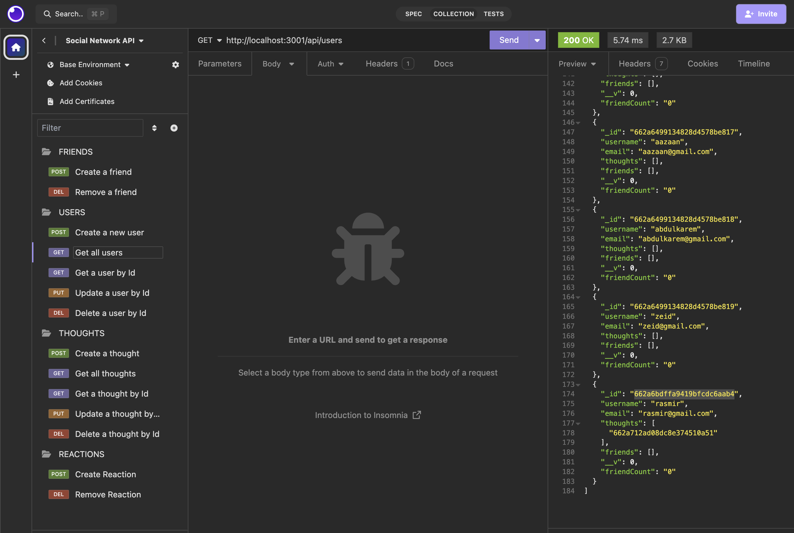

# rasDev-Social-Network-API

# Description

Created a social network API application where users can share their thoughts, can respond to the thoughts and also create friends to the user's friend's list. This application is using Express.js for routing, a MongoDB database, and Mongoose ODM.

## User Story

AS A social media startup
I WANT an API for my social network that uses a NoSQL database
SO THAT my website can handle large amounts of unstructured data

## Acceptance Criteria

GIVEN a social network API
WHEN I enter the command to invoke the application
THEN my server is started and the Mongoose models are synced to the MongoDB database
WHEN I open API GET routes in Insomnia for users and thoughts
THEN the data for each of these routes is displayed in a formatted JSON
WHEN I test API POST, PUT, and DELETE routes in Insomnia
THEN I am able to successfully create, update, and delete users and thoughts in my database
WHEN I test API POST and DELETE routes in Insomnia
THEN I am able to successfully create and delete reactions to thoughts and add and remove friends to a user’s friend list

## License

MIT License - The License file is provided here : (./LICENSE)

## Screenshot

## Github Repository and Demo Link

Github Repository: https://github.com/rasdevworld/rasDev-Social-Network-API

Demo Links :

OR

